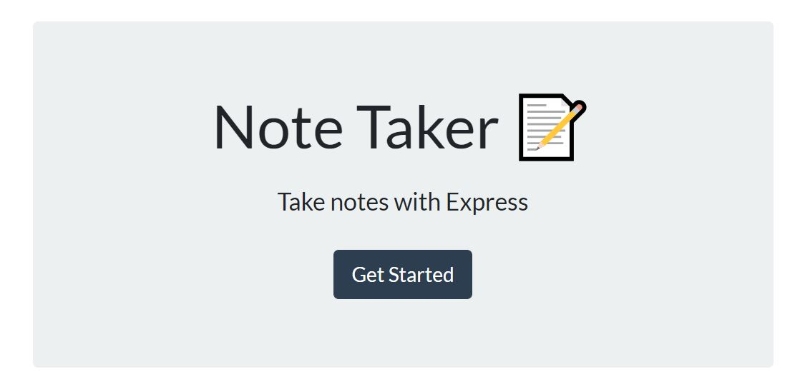
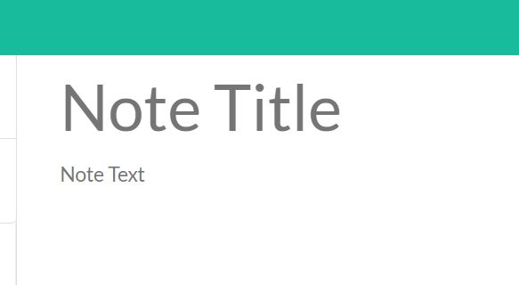
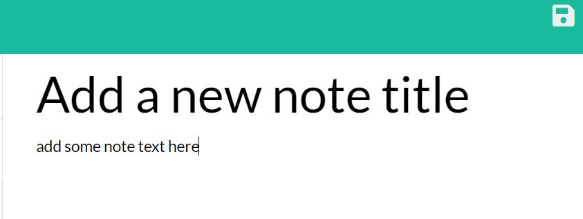
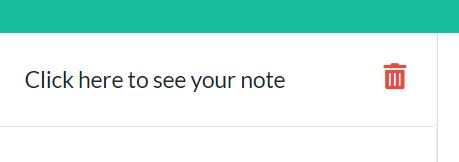
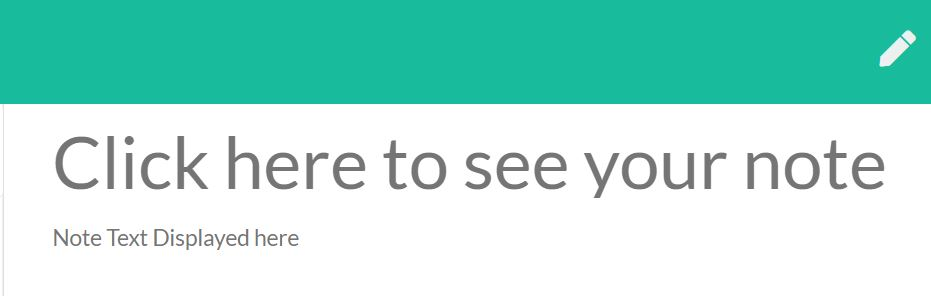

# Note-Taker
An easy to use note taking application

## Table of Contents
  * [Link](#link)

  * [Installation](#installation)

  * [Usage](#usage)
  
  * [License](#license)
  
  * [Questions](#questions)

  ## Link 

  The application is deployed here: https://afternoon-brook-69309.herokuapp.com/

  ## Installation 
  to run locally, dowload the Note-Taker files.  Make sure you have node.js installed, and run node server.js.  Or jsut click the link above.

  ## Usage  
  Click on the get started button to get started.
  

  Add new note, by typing a note title where it says note title, and add your note's text in the text box.
  
  
  Once you've entered a new note, click on the save icon in the upper right to save your note for later (functionality coming soon.)
  

  Previously saved notes are displayed by title on the left. Click on previous notes to display them, or click on the garbage can to delete it.
  

  Previous notes are displayed on the screen, click on the pencil to add a new note.
  

  ## License 
  <https://unlicense.org>

  ## Questions
  Reach out if you have any questions

